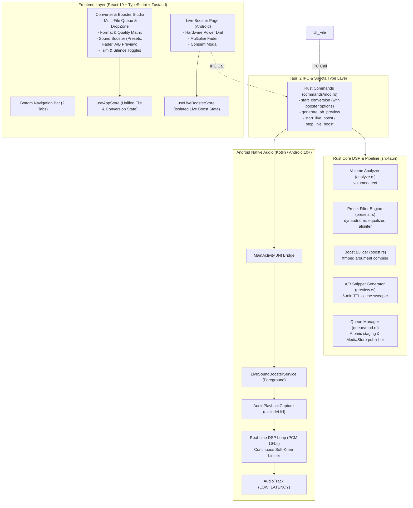

# Sound Booster & Live Audio System Architecture

> **Document Type:** Technical Architecture & System Design Specification  
> **Target Audience:** Senior Engineers, AI Architects, and Audio Systems Consultants  
> **Platform Scope:** Cross-platform Desktop (macOS, Windows, Linux) + Android (API 29+ ARM64)  
> **Tech Stack:** Tauri 2 (Rust) + React 19 + TypeScript + Tailwind CSS v4 + Zustand + FFmpeg 8.1.2 + Android JNI / Kotlin

---

## 1. Executive Summary & Domain Scope

The audio processing capabilities are consolidated into two streamlined, high-craft domains:

1. **Unified Converter & Sound Booster (`src/components/OptionsPanel.tsx` & `src-tauri/src/processing/pipeline.rs`)**:
   - High-quality batch file conversion, trimming, silence removal, and sound amplification in a **single FFmpeg pass**.
   - Dynamic loudness leveling (`dynaudnorm`), safe headroom peak boost (`volumedetect`), low-cut rumble suppression (`highpass`), bass enhancement (`equalizer`), and hard/soft peak protection (`alimiter`).
   - Interactive 10–15s A/B audition preview generator with real-time waveform peak normalization directly inside the options panel.
   - Batch queue processing, progress speed tracking, and Android MediaStore publishing.

2. **Live System Booster (`src-tauri/android/` & `src/features/sound-booster/live-booster/`)**:
   - Real-time Android background audio amplifier utilizing the official Android 10+ `AudioPlaybackCapture` API.
   - **Zero Microphone Permission**: Captures internal digital audio playback directly without `RECORD_AUDIO` mic access, guaranteeing complete privacy.
   - Real-time DSP engine: Gain multiplier ($1.0\times$ to $4.0\times$) + Continuous $C^1$ Soft-Knee Limiter preventing digital clipping and speaker distortion.
   - Self-contained Foreground Service (`LiveSoundBoosterService.kt`) with ongoing notification, `[Stop]` quick action, and low-latency audio rendering (`AudioTrack` PCM 16-bit 44.1kHz).

---

## 2. High-Level Architecture Diagram



---

## 3. Rust Backend & DSP Pipeline Specification

### 3.1. Preset Matrix & Filter Chains (`presets.rs`)

Every booster preset is mathematically designed and **always terminates with `alimiter`** to ensure output samples never exceed $-0.5\text{ dBFS}$ (True Peak protection).

| Preset ID | Primary Filter Chain | Limiter Stage | Target Use-Case |
| :--- | :--- | :--- | :--- |
| `smart` | `dynaudnorm=f=150:g=15:p=0.95:m=10.0:r=0.9:b=1` | `alimiter=limit=0.95:attack=5:release=50:asc=1` | Auto-leveling for quiet YouTube videos, voice messages, lectures. |
| `music` | `volume={headroom}dB` (Safe gain based on `volumedetect`) | `alimiter=limit=0.95:attack=7:release=100:asc=1` | Dynamic headroom amplification for music tracks preserving balance. |
| `voice` | `highpass=f=80,dynaudnorm=f=100:g=21:p=0.95:m=12.0:r=0.9` | `alimiter=limit=0.95:attack=3:release=30:asc=1` | Low-cut rumble filter + fast speech leveling for podcasts/calls. |
| `bass` | `equalizer=f=60:t=q:w=1:g=6,dynaudnorm=f=200:g=15:p=0.95:m=8.0` | `alimiter=limit=0.95:attack=10:release=100:asc=1` | 60Hz sub-bass boost + controlled compression for club/EDM. |
| `extreme` | `volume=12dB` | `alimiter=limit=0.95:attack=2:release=20:asc=1` | Maximum loudness boost for extremely low-volume source recordings. |
| `manual` | `volume={ratio}` ($0.0\times$ to $2.0\times$, calculated via $20\log_{10}$) | `alimiter=limit=0.95:attack=5:release=50:asc=1` | User-defined slider control ($0\%$ to $200\%$). |

### 3.2. Optimized Execution Pipeline (`pipeline.rs`)

1. **Conditional Analysis Bypass**: Volume analysis via `volumedetect` is ONLY executed when `preset == BoosterPreset::Music`. For presets using `dynaudnorm` or static gains, full-file analysis is skipped, saving 15–40s of CPU decoding on large files.
2. **Stream Mapping Safety**: Specifies `-map 0:a:0?` and `-vn` to gracefully handle video inputs with multiple embedded streams or unsupported video codecs.
3. **Atomic File Staging**: Output is generated into an isolated temporary `.tmp` path and atomically moved upon completion.
4. **MediaStore Publishing**: On Android, outputs are published to `Music/AudioConverter/` and indexed into Android `MediaStore`.

### 3.3. A/B Audition Preview Generator (`preview.rs`)

- Extracts a dynamic 10–15s window (typically starting at $25\%$ of duration or user trim start).
- Transcodes to uncompressed 16-bit PCM WAV (`pcm_s16le`, 44.1kHz stereo) for instantaneous browser HTML5 audio playback.
- Generates both `orig_{ts}_{seq}.wav` and `boost_{ts}_{seq}.wav`.
- **TTL Cache Sweeper**: `sweep_old_previews()` automatically deletes temporary preview WAV files older than 5 minutes on every call, preventing storage leaks.
- Computes 40-bucket normalized waveform min/max peaks for synchronized visual comparison.

---

## 4. Android Real-Time Audio Architecture (`LiveSoundBoosterService.kt`)

### 4.1. Privacy-First Audio Capture (Zero Microphone)

Traditional booster apps request `RECORD_AUDIO` and capture sound from the device microphone, creating ambient noise, distortion, and serious privacy red flags.

Our implementation uses **`AudioPlaybackCapture` (Android 10 / API 29+)**:
- Captures internal digital audio from `USAGE_MEDIA`, `USAGE_GAME`, and `USAGE_UNKNOWN`.
- Excludes `USAGE_VOICE_COMMUNICATION` per Android privacy policy (honestly communicated in UI).
- **Feedback Loop Prevention**: Includes `.excludeUid(android.os.Process.myUid())` so `AudioRecord` never captures the app's own playback from `AudioTrack`.

### 4.2. Continuous $C^1$ Soft-Knee DSP Limiter

To avoid harsh digital clipping when multiplying 16-bit PCM samples by $1.0\times - 4.0\times$ gain, a real-time continuous soft-knee limiter is executed inside the audio thread:

$$\text{norm} = \frac{\text{sample}}{32768.0}$$

$$\text{limited}(x) = \begin{cases} 
x & |x| \le 0.75 \\
\text{sgn}(x) \cdot \left(0.75 + 0.25 \cdot \tanh\left(\frac{|x| - 0.75}{0.25}\right)\right) & |x| > 0.75 
\end{cases}$$

$$\text{sample}_{\text{out}} = \text{clamp}\left(\lfloor \text{limited} \cdot 32767.0 \rfloor, -32768, 32767\right)$$

- **Mathematical Continuity**: At $|x| = 0.75$, the output is continuously differentiable ($C^1$), eliminating step jumps and preventing audible buzzing artifacts.
- **Latency Optimization**: Direct `ShortArray` buffer processing in a high-priority background thread with `AudioTrack.PERFORMANCE_MODE_LOW_LATENCY`.

---

## 5. Frontend & State Management Architecture

### 5.1. Domain Isolation

The Sound Booster state is strictly decoupled from the Converter file list:
- `useFileBoosterStore.ts`: Manages single active booster file, preset, manual gain, A/B preview state, and export progress.
- `useLiveBoosterStore.ts`: Manages live service toggle state, multiplier gain, and consent modal.
- `useAppStore.ts`: Global settings, theme, and language.

### 5.2. Reactive Synchronization & Queue Isolation

- **Queue Filtering**: `useFileBooster.ts` captures the active `boostJobId` on export and strictly filters Tauri `"job-event"` streams to ignore regular conversion batch events.
- **Native Android State Sync**: `MainActivity.kt` evaluates `window.dispatchEvent(new CustomEvent('ac:live-boost-state', { detail: { isRunning } }))` when the foreground service starts, stops via notification, or gets cancelled by user dialog dismissals.
- **Window Focus Resync**: When the app window regains focus, `getLiveBoostStatus()` automatically resynchronizes the UI power toggle state.

---

## 6. Directory Map

```
audio-converter/
├── src/
│   ├── components/
│   │   ├── BottomNavigation.tsx        # Mobile-first glassmorphism bottom navigation
│   │   └── NavigationTabs.tsx          # Top tab navigation component
│   └── features/
│       └── sound-booster/
│           ├── shared/
│           │   └── boosterTypes.ts     # Presets metadata, badges, and interfaces
│           ├── stores/
│           │   ├── useFileBoosterStore.ts # Isolated Zustand store for File Booster
│           │   └── useLiveBoosterStore.ts # Isolated Zustand store for Live Booster
│           ├── file-booster/
│           │   ├── hooks/useFileBooster.ts  # Audio player lifecycle & preview hook
│           │   ├── FileBoosterPage.tsx      # Main File Booster container
│           │   ├── PresetSelector.tsx       # Custom SVG vector preset cards
│           │   ├── GainSlider.tsx           # Hardware-style precision slider
│           │   └── ABPreview.tsx            # Synchronized dual waveform player
│           └── live-booster/
│               ├── hooks/useLiveBooster.ts  # Native Android sync hook
│               ├── LiveBoosterPage.tsx      # Clean Live Booster container
│               ├── LiveBoosterToggle.tsx    # Hardware power dial & fader slider
│               └── ConsentExplainerSheet.tsx# Android MediaProjection consent sheet
├── src-tauri/
│   ├── android/
│   │   ├── LiveSoundBoosterService.kt  # Android 10+ AudioPlaybackCapture service
│   │   └── MainActivity.kt             # MediaProjection launcher & JNI bridges
│   └── src/
│       └── processing/
│           └── sound_booster/
│               ├── mod.rs              # Booster module exports
│               ├── analyze.rs          # FFmpeg volumedetect runner
│               ├── presets.rs          # 5 presets + manual limiter definitions
│               ├── boost.rs            # Output argument builder
│               ├── preview.rs          # 10-15s WAV audition generator + sweeper
│               └── pipeline.rs         # Background worker export pipeline
```
